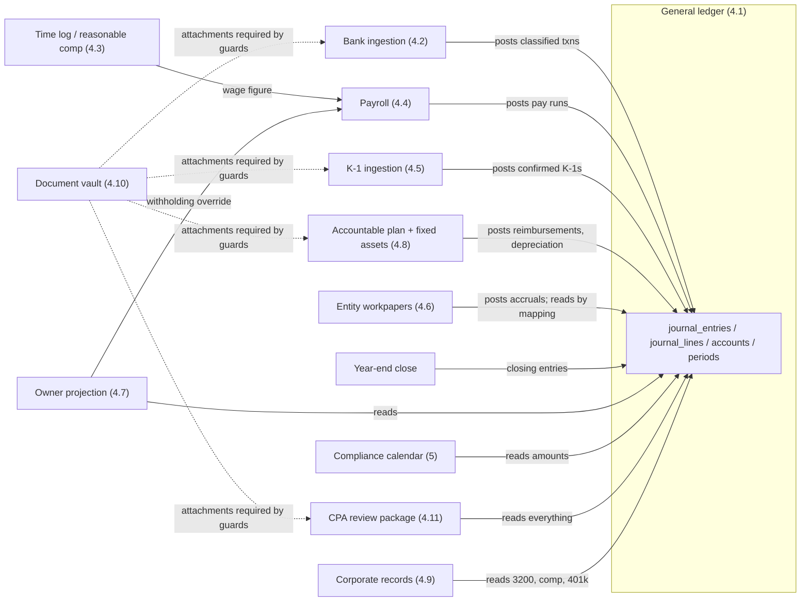
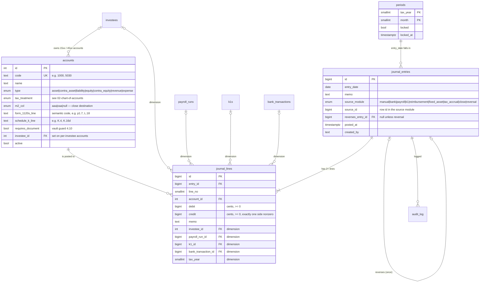
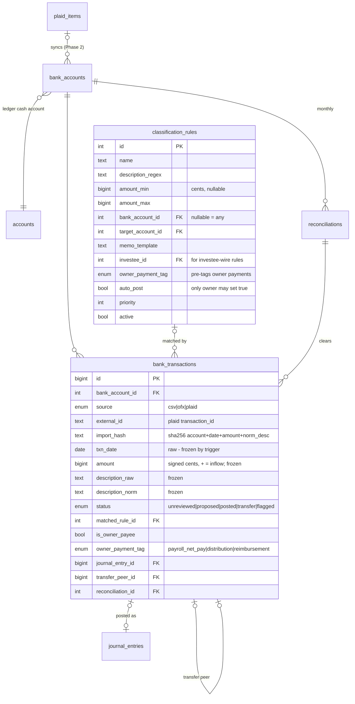
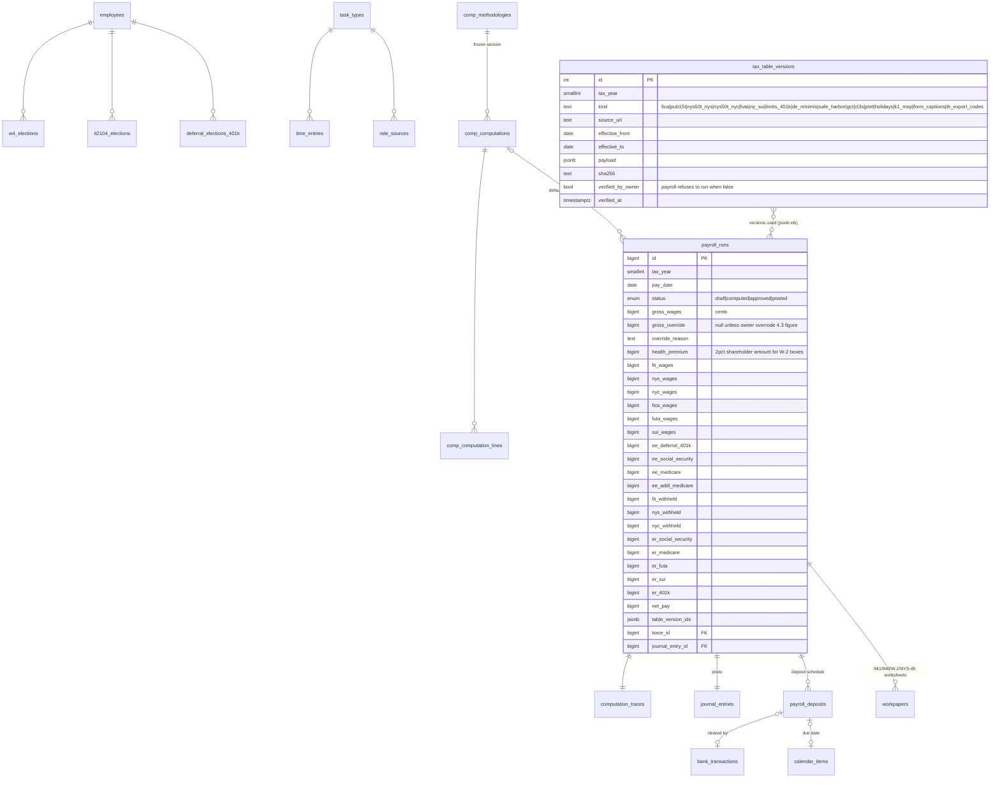
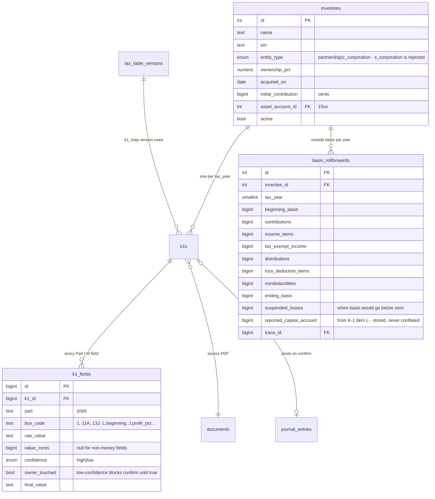
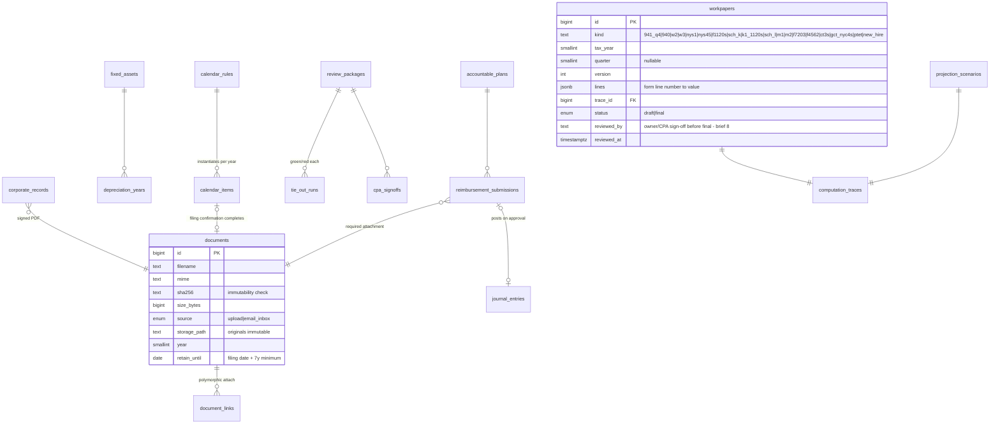

# Data model (proposed)

Status: **proposal — not yet approved, no code exists.** Companion files: the chart of accounts
is `02-chart-of-accounts.md`; the invariants in §6 below are implemented as Postgres DDL in
`03-ledger-invariants.sql`; the bank flow in `04-bank-ingestion-flow.md`.

## 1. Principles (from the brief, restated as schema rules)

1. **The ledger is the hub.** Every module either writes journal entries or reads account
   balances/lines. No module table stores a total that could disagree with the ledger; module
   tables store *workflow state* and *computation traces*, and link to the entries they posted.
2. **Append-only journal.** `journal_entries`/`journal_lines` accept `INSERT` only; the database
   itself rejects `UPDATE`/`DELETE`. Corrections are reversing entries that reference the
   original. Locked periods reject new entries dated inside them.
3. **Integer cents.** All money columns are `BIGINT` cents (domain `cents`). Tax math happens in
   a decimal library with per-step documented rounding; IRS whole-dollar rounding is applied in
   workpapers, never in the ledger.
4. **Dimensions, not re-classification.** Journal lines carry nullable `investee_id`,
   `payroll_run_id`, `k1_id`, `bank_transaction_id`, `tax_year`. Downstream modules (basis
   roll-forward, workpapers, tie-outs) query by dimension.
5. **Reproducibility.** Every computed figure that can land on a return stores a
   `computation_trace` (inputs, table versions, ordered intermediates, outputs) and the ids of
   the `tax_table_versions` used.
6. **Per-year data, not code.** Rates, wage bases, thresholds, due-date rules, form-line
   captions, and the K-1→1120-S mapping are versioned per-year files loaded into
   `tax_table_versions` and refused for use until `verified_by_owner`.

## 2. Module map

## 3. ERD — core ledger

Reports (trial balance, P&L, balance sheet, GL detail, register, all as-of-date) are SQL views
over these four tables — no report table stores totals.

## 4. ERD — remaining modules (key tables; full catalog in §5)

### 4a. Banking

### 4b. Payroll + time/comp

### 4c. Investees + K-1

### 4d. Supporting modules

## 5. Table catalog

Money columns are `cents` (BIGINT) throughout; timestamps `timestamptz`; every table has
`created_at`. FKs `ON DELETE RESTRICT` everywhere — nothing cascades in an audit system.

**Ledger (4.1):** `accounts`, `periods`, `journal_entries`, `journal_lines`, `audit_log`
(append-only: actor, action, object, before/after jsonb, table versions), `computation_traces`
(kind, inputs, table_version_ids, ordered steps with rounding notes, outputs).

**Banking (4.2):** `bank_accounts`, `bank_transactions`, `classification_rules`,
`rule_suggestions` (two-similar-manual-classifications heuristic output awaiting owner),
`reconciliations` (statement_date, statement_balance, ledger_balance, difference, status),
`plaid_items` (access_token_encrypted, cursor, status — Phase 2).

**Time/comp (4.3):** `task_types`, `time_entries`, `rate_sources` (rate, source kind + citation,
salary-conversion assumption, captured_on), `corroboration_metrics` (deal counts/volume by
period), `comp_methodologies` (version, parameters, frozen_at — frozen before 1/1/2027),
`comp_computations` + `comp_computation_lines` (hours × rate by task type, snapshot of sources),
export pack is a generated document in the vault.

**Payroll (4.4):** `employees` (SSN encrypted at rest), `w4_elections` (2020+ fields, effective-
dated), `it2104_elections`, `deferral_elections_401k` (effective date must predate pay date),
`health_insurance_config` (per year: arrangement, annual premium, policy holder),
`tax_table_versions`, `payroll_runs`, `payroll_deposits` (authority EFTPS/NYS-1/NYS-45/FUTA,
amount, due date, rule applied — e.g. `monthly` vs `next_day_100k` —, status, clearing
bank_transaction_id), `workpapers` (shared with 4.6), `limit_checks_401k` (deferral cap,
catch-up, 25%-of-comp employer cap per plan definition, 415(c) overall cap, headroom, deadline).

**K-1 (4.5):** `investees`, `k1s` (status uploaded→extracted→in_review→confirmed→posted,
extraction model id from config), `k1_fields`, `basis_rollforwards`, K-1→1120-S mapping is a
`tax_table_versions` row (`kind = k1_map`), not a table of its own.

**Workpapers/tax (4.6):** `workpapers`, `tax_accruals` (year, jurisdiction GCT/NYS-FDM/PTET,
computed liability, trace, journal_entry_id → 2200/2210 against 5200), `shareholder_basis_years`
(Form 7203 stock-basis roll-forward — distinct from investee outside basis), `ptet_elections`
(year, elected NYS/NYC, election date, estimates linkage).

**Projection (4.7):** `projection_scenarios` (as-of, inputs jsonb: expected K-1 items, planned
comp, household income; results jsonb: fed/NYS/NYC liability, safe-harbor target, recommended
December withholding override, residual ES payments; trace), `estimated_payments` (level:
owner_federal/owner_nys+nyc/entity_gct/entity_ptet; period; due; amount; paid_on; source manual
or ledger-derived; bank_transaction_id).

**Accountable plan + assets (4.8):** `accountable_plans` (adopted policy document, substantiation
window, categories), `plan_year_inputs` (per year: home-office square footages, rent/utilities/
insurance totals, phone/internet business-use %), `reimbursement_submissions` (category, amount,
computation jsonb, required document, approved_on, status draft→submitted→approved→posted→paid,
journal_entry_id, paying bank_transaction_id), `fixed_assets` (cost, de-minimis flag from
per-year threshold, method, §179/bonus elections, placed-in-service, disposal),
`depreciation_years` (per asset per year: deduction, trace → feeds Form 4562 worksheet).

**Corporate records (4.9):** `corporate_records` (kind: annual_consent | preyear_consent |
standing document kinds CP261, CT-6, EIN letter, plan adoption, insurance, operating agreement,
NY employer registration; data snapshot it was generated from; signed document; status
generated→signed; gaps reported where a standing kind has no row).

**Vault (4.10):** `documents`, `document_links` (document_id + linked_type + linked_id),
`inbox_items` (email-forward queue, Phase 3), retention/export handled by year attribute.

**Calendar (5):** `calendar_rules` (due-date rule jsonb with weekend/holiday rollover, amount
source ref, channel, applicability), `calendar_items` (computed due date, amount, status
upcoming→due→done/n_a, completing document), holiday sets live in `tax_table_versions`
(`kind = holidays`).

**CPA package (4.11):** `review_packages` (year, version, status draft → final |
final_with_open_items, cover memo, artifact path, diff vs prior version), `tie_out_runs`
(tie-out key, green/red, detail, owner_note — required on red before `final_with_open_items`),
`open_items`, `cpa_signoffs`; the trial-balance export code table per tax product is
`tax_table_versions` (`kind = tb_export_codes`).

**Infra (6):** `users` (single owner; minimal real auth), `app_config` (encrypted values:
Anthropic model id, Plaid env, NYS DOL answers — SUI treatment of 2% health premiums, DBL/PFL/WC
applicability — stored once as configuration per brief).

## 6. Journal-entry invariants (the contract; SQL in `03-ledger-invariants.sql`)

| # | Invariant | Enforced by |
|---|---|---|
| I1 | Every entry balances: Σdebit = Σcredit, in cents | deferred constraint trigger at commit |
| I2 | Every entry has ≥ 2 lines | deferred constraint trigger |
| I3 | Each line has exactly one positive side; both columns ≥ 0; integer cents | CHECK constraints + `cents` domain |
| I4 | Journal is append-only: no UPDATE/DELETE ever; corrections are reversing entries | triggers + REVOKE on app role |
| I5 | A reversal references its original, mirrors its lines with sides swapped, and an entry can be reversed at most once; reversals of locked-period entries are dated in an open period | partial unique index + `post_reversal()` server function |
| I6 | No entry dated inside a locked period | BEFORE INSERT trigger against `periods` |
| I7 | A posted bank transaction links to exactly one journal entry (transfer pairs share one) | CHECK + unique index |
| I8 | An outflow to the owner never posts untagged: `payroll_net_pay` \| `distribution` \| `reimbursement` | CHECK on `bank_transactions` |
| I9 | A line on a per-investee account (15xx/45xx with `investee_id`) must carry the matching `investee_id` dimension | BEFORE INSERT trigger |
| I10 | Every entry declares `source_module` (+ `source_id` for non-manual); `reversal` ⇔ `reverses_entry_id` set | CHECK constraints |
| I11 | Accounts with posted lines cannot be deleted or re-typed; mapping changes are new-year data-file events | FK RESTRICT + trigger |
| I12 | Raw bank-transaction fields are immutable after import; only workflow columns may change | column-diff trigger |
| I13 | Every posted entry produces an audit row | AFTER INSERT trigger (app adds richer context) |

§6 of the brief additionally requires a property test: a random-entry generator must never be
able to produce an unbalanced entry or an entry dated into a locked period (the DB must reject,
not the app).

## 7. Posting templates (what each module writes)

**Bank classification (source `bank`)** — one entry per posted transaction; lines carry
`bank_transaction_id`. Special patterns are forced by guards (see `04-bank-ingestion-flow.md`):
investee wire in → Dr 1000 / Cr 15xx (never revenue); EFTPS/NYS/SUI/401(k) debits → Dr specific
21xx liability / Cr 1000 (never expense); transfers → Dr/Cr the two cash accounts.

**Payroll (source `payroll`)** — the December run, entity-paid health variant. EE-side taxes and
the deferral come out of gross, so they appear only inside the credits:

| Line | Account | Dr | Cr |
|---|---|---|---|
| Officer gross wages | 5000 | gross | |
| ER payroll taxes (SS + Medicare + FUTA + SUI) | 5010 | er_total | |
| ER 401(k) contribution | 5020 | er_401k | |
| FIT withheld | 2100 | | fit |
| Social Security (EE + ER) | 2110 | | ss_ee + ss_er |
| Medicare (EE + ER + Additional) | 2120 | | med_total |
| NYS withholding | 2130 | | nys |
| NYC withholding | 2140 | | nyc |
| FUTA | 2150 | | futa |
| NY SUI | 2160 | | sui |
| EE 401(k) deferral | 2170 | | deferral |
| ER 401(k) payable | 2180 | | er_401k |
| Net pay | 1000 | | net |

Health insurance: if entity-paid direct or reimbursed through §4.8 during the year, 5030 was
already debited at payment — the run only adds the premium to `fit_wages`/W-2 Box 1/Box 14
(non-cash, no additional expense line; expensed exactly once per brief §8). Deposit rows
(EFTPS monthly vs next-day $100k check, NYS-1 5-business-day, FUTA quarterly-if->$500, SUI with
NYS-45) are generated from the run against per-year rule tables.

**K-1 confirm (source `k1`)** — lines carry `investee_id`, `k1_id`, `tax_year`:
Box 1 → Dr 15xx / Cr 4500; each separately stated item → its 45xx account against 15xx;
tax-exempt income → Dr 15xx / Cr 4600 (OAA path); nondeductibles → Dr 4610/4615 / Cr 15xx.
Box 19 distributions are *not* posted here — the wires already credited 15xx in §4.2; the module
reconciles box 19 against those postings and reports any difference.

**Reimbursement (source `reimbursement`)** — approval: Dr 504x by category / Cr 2190 (health-
premium category posts to 5030 instead); payment: bank txn tagged `reimbursement` posts
Dr 2190 / Cr 1000.

**Fixed assets (source `fixed_asset`)** — purchase above de-minimis: Dr 1600 / Cr 1000; annual
depreciation: Dr 5050 / Cr 1610; at-or-below threshold: Dr 5055 / Cr 1000 at classification.

**Tax accrual (source `tax_accrual`)** — Dr 5200 / Cr 2200 (GCT) or 2210 (NYS FDM / PTET), from
§4.6 computations; payments clear the 22xx accounts via bank classification.

**Close (source `close`), 12/31, in order:**
1. Meals reclass: Dr 5900 / Cr 5130 for the disallowed 50% (year-total, IRS rounding, traced).
2. Close all revenue/expense to 3900.
3. Split 3900: OAA items (tax-exempt income net of related nondeductibles, i.e. `m2_col = oaa`
   accounts) → 3110; remainder → 3100 (AAA).
4. Close 3200 distributions → 3100.

The M-2 workpaper (not the ledger) applies the statutory ordering rules — e.g. distributions
cannot drive AAA below zero on the form even though the ledger nets them — and reconciles to
these balances.

**Reversal (source `reversal`)** — only via `post_reversal()`: mirrored lines, same dimensions,
dated in an open period, original marked reversed-once.

## 8. Design decisions requiring approval (beyond the brief's letter)

1. **`tax_treatment` enum extended** from the brief's five values with `taxable_ordinary`
   (revenue reaching page 1: 4000, 4500) and `tax_exempt` (OAA income), plus an orthogonal
   `m2_col` attribute (`aaa`/`oaa`) so the close routine and M-2 are pure queries.
2. **Meals 50% mechanics:** post the full amount to 5130 during the year (preserves "what did I
   spend"); the close reclasses the disallowed half to 5900 with a trace. Every 1120-S line is
   then exactly one account-balance query with no report-time percentage math. Alternative
   (compute at report time, no reclass) available if you prefer P&L purity.
3. **Form-line mappings are semantic codes** (`p1.7`, `L.18`, `K.16d`, `M2.col_a`) on the
   account row; a per-year `form_captions` data file maps codes to that year's printed line
   numbers/captions. Keeps §4.1's account-level mapping *and* §8's no-hardcoding rule.
4. **Bank transactions are one table** with raw columns frozen by trigger and workflow columns
   mutable (vs. a separate state table). Simpler joins; immutability still database-enforced.
5. **Periods are monthly** with year-scoped locks done month-by-month at close; reversals of
   locked-period entries are dated in the first open period (standard practice).
6. **Own-account interest** (business checking interest, if any) posts to the same 45xx
   separately-stated accounts as K-1 pass-through items, distinguished by absent `investee_id`
   — avoids duplicate account families.
7. **45xx accounts are created on first use** from the K-1 box catalog (royalties, investment
   interest expense, etc.) rather than pre-seeding every possible box — "refine, don't bloat."
8. **Traces are jsonb** with a versioned shape per computation kind, exportable as a worksheet
   (§6), rather than normalized step tables.
