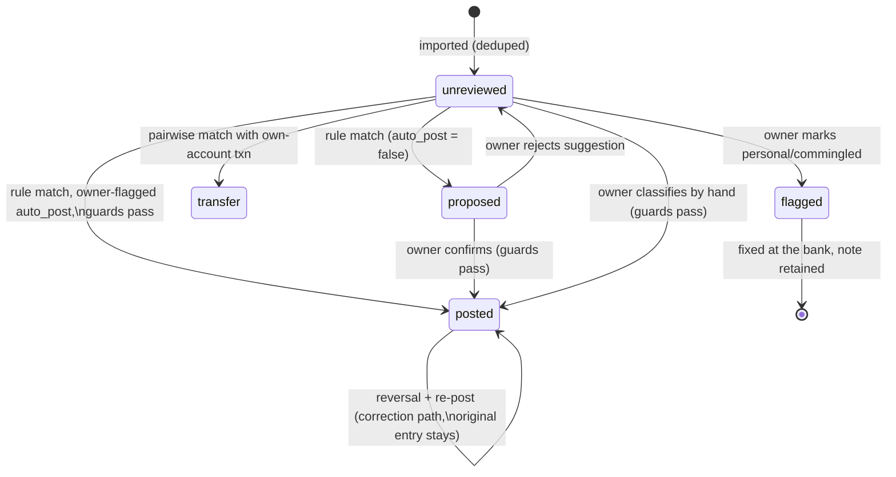

# Bank ingestion → classification → posting (proposed)

Status: **proposal.** CSV/OFX import is built first (Phase 1) — it is the fallback the ledger
can always rely on. Plaid (Phase 2) feeds the **same** `bank_transactions` table through the
same states and the same guards; only the acquisition step differs.

## 1. Transaction state machine



`flagged` is the zero-commingling rule (§8): a personal transaction in a business account is an
error to fix at the bank, never a "personal" classification. Nothing ever leaves `posted` — a
wrong posting is corrected by `post_reversal()` plus a new entry; the bank transaction re-links
to the correcting entry and the audit log keeps the chain.

## 2. Sequence: import → classify → post

```mermaid
sequenceDiagram
    actor O as Owner
    participant UI as Import screen
    participant P as Parser/Normalizer
    participant BT as bank_transactions
    participant R as Rules engine
    participant Q as Review queue
    participant G as Posting guards
    participant GL as Ledger
    participant V as Vault
    participant A as Audit log

    O->>UI: upload CSV / OFX
    UI->>P: parse rows, normalize descriptions
    P->>P: import_hash = sha256(account, date, amount, norm desc)
    P->>BT: INSERT new rows status=unreviewed (dupes skipped by unique index)
    P-->>O: import summary: n new / n duplicates / n parse warnings

    Note over R: runs after every import (and nightly)
    R->>BT: read unreviewed
    R->>R: match regex + amount range + account, by priority
    R->>R: pairwise transfer detection (own accounts, offsetting amounts, date window)
    alt transfer pair
        R->>G: post as transfer
        G->>GL: Dr/Cr the two cash accounts
        G->>BT: both txns status=transfer, linked, one shared entry
    else rule match, auto_post = false
        R->>BT: status=proposed (target account, memo, dimensions, tag)
    else owner-flagged auto_post rule
        R->>G: same guard pipeline as manual confirm
        G->>GL: post
        G->>BT: status=posted
    else no match
        R-->>Q: stays unreviewed (queue shows nearest-rule hints)
    end

    O->>Q: open classification queue
    Q-->>O: proposed + unreviewed, grouped by counterparty
    O->>Q: confirm / edit account, memo, dimensions
    opt payment to owner detected
        Q->>O: require tag: payroll_net_pay | distribution | reimbursement
    end
    opt account requires document
        Q->>V: attach receipt/notice
    end
    Q->>G: submit

    Note over G: guards — all must pass, same pipeline for auto_post
    G->>G: owner payee and outflow => tag present (refuse untagged, §4.2)
    G->>G: investee counterparty inflow => force credit 15xx, never revenue
    G->>G: 45xx / 4500 targets rejected (K-1 module only)
    G->>G: EFTPS / NYS / SUI / 401(k) debits => must clear matching 21xx
    G->>G: distribution tag => 3200; reimbursement tag => 2190 with approved submission
    G->>G: requires_document accounts => vault attachment linked
    G->>G: period open, entry balanced (DB re-enforces both)

    alt any guard fails
        G-->>O: blocked, with the specific rule violated
    else all pass
        G->>GL: INSERT journal_entry + lines (dims: bank_transaction_id, investee_id, ...)
        GL->>A: audit row (rule id or manual, before/after)
        G->>BT: status=posted, journal_entry_id linked
    end

    opt after 2 similar hand classifications
        Q-->>O: suggest a rule (regex, amount band, target); owner may flag auto_post
    end
```

## 3. Special patterns (forced classifications, §4.2)

| Pattern (matched on counterparty/description) | Forced posting | Never |
|---|---|---|
| Incoming wire from a known investee | Dr 1000 / **Cr 15xx** (distribution reduces the asset; reconciled against K-1 box 19 in §4.5) | revenue |
| Outgoing payment to the owner | requires tag → net pay (payroll entry already posted; this clears it), 3200 distribution, or 2190 reimbursement | untagged posting |
| EFTPS debit | Dr 2100/2110/2120 / Cr 1000, matched to a `payroll_deposits` row | expense |
| NYS Online Services debit | Dr 2130/2140 (NYS-1) or 2160 (NYS-45) / Cr 1000 | expense |
| 401(k) provider debit | Dr 2170/2180 / Cr 1000 | expense |
| Between own accounts | transfer pair, one entry Dr/Cr cash accounts | income/expense |

## 4. Plaid variant (Phase 2)

Same sink, same states, same guards. Differences only upstream: Link → store Item access token
encrypted → `/transactions/sync` cursor loop → INSERT with `external_id` (dedupe by unique
index) → removed/modified transactions from sync arrive as new facts, never edits to raw rows
(a Plaid "modified" becomes reversal + repost if already posted; a "removed" flags the txn).
Balance endpoint feeds reconciliation. Production access application starts at the top of
Phase 1 — approval lead time is real.

## 5. Monthly reconciliation

```mermaid
sequenceDiagram
    actor O as Owner
    participant REC as Reconciliation
    participant BT as bank_transactions
    participant GL as Ledger

    O->>REC: statement closing balance for month M (typed, or Plaid balance)
    REC->>GL: ledger cash balance for the account as of month-end
    REC->>BT: unposted / unmatched txns dated in or before M
    REC-->>O: difference = statement − ledger, itemized:\nunreviewed txns, uncleared deposits-in-transit, missing imports
    O->>REC: resolve items (classify, import gap, bank error)
    REC->>REC: difference = 0 → mark month reconciled, snapshot stored
    Note over REC: reconciliation report attaches to the 4.11 package;\nperiod lock for M requires a completed reconciliation
```

## 6. CSV/OFX practicalities

- One import profile per bank account (column mapping, date format, sign convention),
  stored as configuration; OFX/QFX parsed natively (FITID feeds `import_hash` fallback).
- Files themselves go into the vault and link to the transactions they created — the §4.11
  package can show statement → import → posting lineage end to end.
- Import is idempotent: re-uploading an overlapping export creates nothing new (hash dedupe),
  so a "did I already import October?" mistake is harmless.
